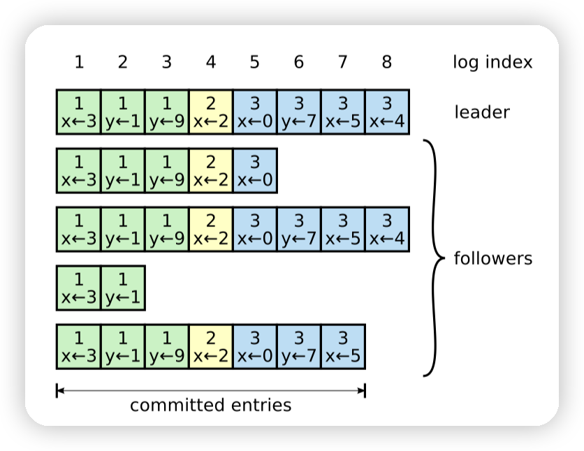

# Raft协议原理

（以下大多数都是对Raft论文的翻译，以及本人对Raft的浅薄理解）
## 1. Raft一致性算法的核心概念

### **复制状态机**

图1

提到共识算法就必须了解分布式系统中经典的共识模型，”复制状态机“，通过复制状态机，我们能够保证任意时间点，两台服务器的状态达到一致的状态。

复制状态机的实现是基于一个假设，只要两个机器的初始状态相同，并且以相同的顺序执行完全相同的命令，那么在任意时刻这两台机器的状态都是一致的。其最主要的原理就是复制日志。这里的复制日志不光保证复制日志的内容完全一致，还需要保证每条日志之间的顺序也是严格一致的。这就要求当网络发生丢包，重复，重排序等等一系列问题时，你所复制的日志仍然要保证上面的特性。

整个模型由三部分构成，共识模型，状态机，日志，如图1所示。

共识模块会从客户端接收命令，并与其他服务器上的共识模块进行通信，以确保每条日志能够在不同的服务器之间保持相同的内容，同时保证日志之间的顺序相同。达成共识之后将其添加到其日志存储模块中。一旦日志（命令）能够被正确复制，且每个服务器的状态机能够按日志顺序执行指令，并将指令执行结果能够返回给客户端，这个服务器就能形成一个高度可靠的状态机。

复制状态机被用于解决分布式系统中的各种容错问题。例如，具有单一集群领导者的大规模系统（如GFS、HDFS和RAMCloud）。

实际系统的共识算法通常具有以下特性：

- 保证安全性（整个服务器群组永远不返回不一致的结果），尽管存在包括网络延迟、分区、数据包丢失、重复和重排序等异常。
- 只要大多数服务器正常运行且能够相互通信和与客户端通信，它们就是完全可用的。比如，典型的五台服务器的集群可以容忍任何两台服务器的故障。假设某台服务器宕机，它可以稍后从稳定存储的状态恢复并重新加入集群。
- 它们不依赖时间来确保日志的一致性。因为不一致的时钟和极端的消息延迟，会对安全性和可用性造成影响。
- 通常情况下，一条命令在集群大多数成员作出响应后立即完成（即大多数节点确认就算命令成功）；少数慢速服务器不会影响整体系统性能。

### **Raft基本概念**
  - **Term**：任期，Raft通过选举得到一个领导者，该领导者在职的这段时间属于一个任期。当集群中的服务器每次重新发起一次选举，都会启用一个新的任期。当新的领导者被选举出来，这个新的任期即在整个集群中达成了共识。
  - **Log**：日志，用于存储每个客户端发起的命令/数据。并由领导者同步给集群中的成员。
  - **Index**：日志索引。代表了每个日志条目存储的顺序。
  - **Commit**：提交。代表某个提议已经被集群中的大多数成员接受。
  - **Apply**：应用，代表状态机将日志对应的指令进行执行。

### **Raft基本流程**

Raft的实现思路是，首先通过投票选举出一个领导者。然后由领导者来完全负责日志复制的任务。领导者接受来自客户端的日志条目，将它们复制到其他服务器上，并告诉服务器何时可以安全地将日志条目应用于它们的状态机。拥有领导者简化了复制日志的管理，因为领导者作为整个集群的权威，同时数据得以以简单的方式从领导者流向其他服务器。由此可见，只要保证了领导者的日志是符合预期的，那么整个集群的日志最终都会和领导者一致，进而整个集群的状态是期望的。领导者可能会宕机或与其他服务器断开连接，在这种情况下，Raft算法将选举出新的领导者。接下来介绍更多的细节。

Raft 集群包含多台服务器；通常是5台，可以容忍2台宕机（因为仍有3台机器可以正常工作，占有集群的大多数票数，后续我们会展开讲为什么可以容忍2台宕机）。在任何给定的时间，每台服务器处于三种状态之一：领导者、跟随者或候选人。

- **领导者**：在正常运行中，最多只有一个领导者，所有其他服务器都是跟随者。领导者处理所有客户端请求（如果客户端发送请求到跟随者，跟随者会将其重定向到领导者）
- **跟随者**，他们是被动工作的，即它们不主动发出请求，而只是对领导者和候选人的请求做出响应。
- **候选人**，用于选举新的领导者，论文第 5.2 节所述。图 2 显示了状态及其转换；下文将讨论这些转换。

图2

Raft 将服务器执行的时间划分为任意长度的任期，如图 3 所示。任期用连续的整数编号。每个任期都从选举开始，其中一个或多个候选人尝试成为领导者。如果候选人赢得选举，那么它将在该任期的其余时间充当领导者。在某些情况下，选举将导致票数分裂。在这种情况下，任期将在没有领导者的情况下结束；新的选举将很快开始。Raft 确保在给定的任期内最多只有一个领导者。

图3

由于现实世界中存在诸多不稳定因素，如网络延迟，丢包，等等，导致不同的服务器可能在不同的时间观察到任期之间的转换，在某些情况下，在集群中的有些服务器可能根本没有观察到选举甚至整个任期。该怎么解决这个问题呢？答案就是任期。在 Raft 中，任期充当逻辑时钟，它们允许服务器检测到过时的信息，例如过期的领导者。每台服务器存储当前的任期编号，该编号随时间单调递增。每当服务器通信时，它们交换当前任期；如果一台服务器的当前任期小于另一台服务器的当前任期，则它将其当前任期更新为较大的值。如果候选人或领导者发现自己的任期已过时，则立即回到跟随者状态。如果服务器收到带有过时任期编号的请求，则拒绝该请求。

Raft 服务器使用远程过程调用（RPC）进行通信，基本共识算法仅需要两种类型的 RPC。RequestVote RPC 是在选举期间由候选人发起的，用于请求其他服务器投票给当前服务器作为领导者。

AppendEntries RPC 是由领导者发起的，用于复制日志条目并提供一种心跳机制。

在论文的第 7 节添加了第三种 RPC，用于在服务器之间传输快照。如果服务器未能及时收到响应，则服务器会重试 RPC，并且为了获得最佳性能，它们会并行发出 RPC。

总结一下：

对于Raft算法来说，他保证了以下几个核心的特性：

1. **选举安全性**：在任意一个任期中，最多只能有1个领导者被选举出来。
2. **领导者-只追加日志**：领导者从不认为自己存在错误，从来不会覆盖或者删除自己已有的日志记录，他只会追加新的日志条目。
3. **日志匹配**：如果两个日志都包含一个具有相同Index和Term的条目，则日志在给定Index**之前**的所有条目中都是相同的。
4. **领导者-完整性**：如果一个日志条目在某个Term中被Commit了，那么这条日志条目会出现在之后所有更高Term的领导者日志中。（之后会论证这一点）
5. **状态机安全性**：如果一个服务器已经Apply了一个指定Index的日志到其状态机中，那么其他所有的服务器都绝对不会Apply一个相同Index但是内容却不同的日志。

_（你可能暂时看到这些信息会比较杂乱，先留个印象，之后你回过头来再看一遍，就会明白每一个特性是怎么实现的，为什么要实现）_

从实现的角度来看，Raft 将共识问题分解为三个相对独立的子问题，这些子问题将在接下来的章节中讨论：

- **领导者选举**：在无领导者时必须选择新的领导者
- **日志复制**：领导者需要接受客户端发起的日志请求，并将他的日志复制到整个集群中，在复制过程中可以强制其他服务器和自己的日志保持一致。
- **安全性**：主要是保证Raft核心特性中的”状态机安全性“。即：如果一个服务器已经Apply了一个指定Index的日志到其状态机中，那么其他服务器绝对不会Apply一个相同Index但是内容却不同的日志。后边会介绍解决这个问题所需要引入的一些额外限制。

（接下来将展开介绍怎么实现上边提到的各种特性。等介绍完之后，我强烈建议你回过头来再看一遍这几个特性，了解他们是怎么实现的，为什么要实现。）

## 2. Raft的Leader选举机制

Raft 使用心跳机制来触发领导者选举。

- 所有服务器在刚启动时，都是作为跟随者。
- 只要服务器从领导者或候选者那里收到有效的 RPC，就会保持在跟随者状态。
- 领导者定期发送心跳（不携带日志条目的 AppendEntries RPC）到所有跟随者，以维护其权威。
- 如果一个跟随者在一段时间内（选举超时时间）内没有收到有效的RPC，那么它就会假设没有可行的领导者，并开始选举选择新的领导者。

为了开始选举，一个跟随者会增加其当前任期并转换为候选者状态。然后它会为自己投票，并并行向集群中的每个其他服务器发出 RequestVote RPC。候选者会一直保持这种状态，直到以下三种情况之一发生：

1. 它赢得了选举
2. 另一个服务器选举成为了领导者
3. 选举超时而没有获胜者。

这些结果在下面的段落中分别讨论。

- 候选者赢得选举的条件是它在整个集群中获得了同一任期的大多数服务器的投票。每个服务器在给定的任期内最多只会为一个候选者投票，按照先到先服务的原则（注意：第 3.6 节对投票增加了额外的限制）。多数规则确保最多只有一个候选者可以赢得特定任期的选举（图 3.2 中的选举安全性属性）。一旦候选者赢得选举，它就成为了领导者。然后它会向所有其他服务器发送心跳消息，以建立其权威并防止新的选举。
- 在等待投票的过程中，候选者可能会从另一个声称自己是领导者的服务器接收到 AppendEntries RPC。如果该领导者的任期（包含在其 RPC 中）至少与候选者的当前任期一样大，则候选者将认可该领导者的合法性并返回到跟随者状态。如果 RPC 中的任期小于候选者的当前任期，则候选者会拒绝该 RPC 并继续保持候选者状态。
- 第三种可能的结果是，候选者既不赢得选举也不失去选举：如果许多跟随者同时成为候选者，则投票可能会分裂，以至于没有候选者获得多数。当这种情况发生时，每个候选者都会超时并通过增加其任期并发起另一轮 RequestVote RPC 来开始新的选举。但是，如果没有额外的措施，分裂的投票可能会无限地重复（后面还会介绍preVote机制来缓解这一问题）。

Raft 使用随机化选举超时来减少分裂投票的情况。选举超时是从固定间隔（例如，150-300 毫秒）中随机选择的。这样一来，服务器发起选举的时机就会分散开来，以便在大多数情况下只有一个服务器会超时（超时时间最短的那个服务器最先到达超时）；理想情况下，它会在其他服务器超时之前赢得选举并发送心跳。

## 3 Raft的日志复制流程

一旦选出领导者，它就开始为客户端请求提供服务。每个客户端请求包含一个复制状态机可执行的命令。领导者将命令封装为一个新条目添加到其日志中，然后向集群中的每个其他服务器并行发出 AppendEntries RPC 来复制该条目。当条目已经**安全地复制**（一会儿会介绍这个安全地复制具体的定义）时，领导者将该条目应用于其状态机，并将执行结果返回给客户端。如果有少数跟随者崩溃或运行缓慢，或者网络数据包丢失，领导者将无限期重试 AppendEntries RPC（即使它已经响应客户端），直到所有跟随者最终存储所有日志条目。

图4

日志的组织如图 4 所示。每个日志条目都存储一个状态机命令以及领导者接收该条目时的任期号。日志条目中的任期号用于检测日志之间的不一致性，同时用于保证Raft的一些核心特性。每个日志条目还有一个整数索引，用于标识其在日志中的位置。

领导者决定何时**安全**地将日志条目应用于状态机。Raft 保证已提交的条目是持久的，并且最终会被所有可用的状态机执行。

这里Raft定义的安全为：

- 一旦创建条目的领导者在大多数服务器上复制了它（例如，图 4中的条目 7），这样的条目称为已提交。已提交的日志才可以被状态机执行。

当一个日志条目变为已提交，这也提交了领导者日志中的所有先前条目，包括前任领导者创建的条目。第 3.6 节讨论了在领导者变更后应用此规则时的一些微妙之处，并且还证明了此提交定义是安全的。领导者记录下其已提交的最高索引，并将该索引信息合并在未来的 AppendEntries RPC（包括心跳）中，以便其他服务器最终发现。

一旦跟随者了解到一个日志条目已经提交，它就会将该条目应用于其本地状态机（按日志顺序）。Raft 保持以下属性，这些属性共同构成了日志匹配属性：

- **如果不同服务器日志中的两个条目具有相同的索引和任期，则它们这条日志存储相同的命令。**
- **如果不同服务器日志中的两个条目具有相同的索引和任期，则在所有先前日志都是相同的。**

第一个属性Raft这样来保证：在给定任期内，最多只会产生一个领导者，且领导者最多只会创建一个具有给定日志索引的条目，并且日志条目永远不会更改其在日志中的位置。

第二个属性由 AppendEntries RPC执行的一致性检查所保证。在发送 AppendEntries RPC 时，领导者会把前一条日志（相对于新发送给跟随者的日志）的索引和任期一起发给跟随者。如果跟随者在其本地日志最新条目中（未添加新日志之前），发现和AppendEntries RPC中的前一条日志的索引和任期不匹配，则它会拒绝新条目。一致性检查充当归纳步骤：日志的初始空状态满足日志匹配属性，而一致性检查会在添加日志时保持日志匹配属性。因此，每当 AppendEntries 成功返回时，领导者都知道跟随者的日志与其自己的日志在新条目之前是相同的。

**异常情况**：

在正常操作期间，领导者和跟随者的日志保持一致，因此 AppendEntries 一致性检查永远不会失败。然而，领导者崩溃可能导致日志不一致（旧领导者可能尚未完全复制其日志中的所有条目）。这些不一致性可以随着一系列领导者和跟随者崩溃而累积。图 5 说明了跟随者的日志可能与新领导者的日志不同的方式。

图5

- 跟随者可能缺少一部分日志条目(a–b)。
- 跟随者可能包含额外的未提交的日志条目(c–d)。,
- 或者同时发生这两者，即缺少一部分领导者的日志，同时也包含额外的未提交的日志(ef)。
- 例如f场景：当f对应的服务器在任期2的时候是领导者，增加了一些日志条目到其本地日志。并在提交这些日志之前发生宕机。紧接着他快速恢复，并成为了任期3的领导者，又添加了一些任期3的日志条目到其本地日志，这些任期3的日志条目同样没有成功提交。随后他又发生宕机，并在接下来的几个任期中都没有恢复过来。

**冲突解决思路：**

在 Raft 中，领导者通过强制跟随者的日志与自己的日志保持相同来处理不一致。这意味着跟随者日志中的冲突条目将被领导者日志中的条目覆盖。第 3.6 节将说明，结合选举限制，这是安全的。

为了使跟随者的日志与自己的日志一致，领导者必须找到两个日志达成一致的最新日志条目，删除该点之后跟随者日志中的任何条目，并将该点之后的所有领导者的条目发送给跟随者。所有这些操作都是响应于 AppendEntries RPC 执行的一致性检查。

**冲突解决实现：**

领导者为每个跟随者维护一个 nextIndex，它是领导者将发送给该跟随者的下一个日志条目的索引。当领导者首次掌权时，它将所有 nextIndex 值初始化为其日志中最后一个日志条目之后的索引（例如，图 3.6 中的 11）。如果跟随者的日志与领导者的日志不一致，那么下一个 AppendEntries RPC一致性检查将会失败。在拒绝后，领导者会减小跟随者的 nextIndex，并重试 AppendEntries RPC。最终，nextIndex 将达到一个点，领导者和跟随者日志匹配。发生这种情况时，AppendEntries 将成功，这将移除跟随者日志中的任何冲突条目，并附加领导者日志中的条目（如果有）。一旦 AppendEntries 成功，跟随者的日志就与领导者的日志一致了，并且在该任期的其余时间内将保持一致。

领导者可以发送不带任何条目的 AppendEntries（如心跳）以节省带宽，直到领导者发现其自己和跟随者的日志在哪里匹配。然后，一旦 matchIndex 紧接着 nextIndex，领导者应该开始发送实际条目。

_【注】：如果需要，可以优化AppendEntries RPC 的数量来减少通信成本。例如，在拒绝一个 AppendEntries 请求时，跟随者可以返回冲突条目的任期和其存储的该任期的第一个索引。有了这些信息，领导者可以减少 nextIndex 以跳过该任期中的所有冲突条目；每个具有冲突条目的任期将需要一个 AppendEntries RPC，而不是每个条目一个 RPC。或者，领导者可以使用二分搜索方法来找到跟随者的日志与自己的日志不同的第一个条目；实际上，我们怀疑这些优化是不必要的，因为故障发生不频繁，而且不太可能存在许多不一致的条目。_

有了这种机制，领导者在掌权时不需要采取任何特殊行动来恢复日志的一致性。它只需开始正常操作，日志就会自动在 AppendEntries 一致性检查失败时收敛。领导者永远不会覆盖或删除其自己日志中的条目（图 3.2 中的领导者追加唯一性属性）。

这种日志复制机制展示了第 2.1 节中描述的可取的一致性属性：只要大多数服务器正常，Raft 就可以接受、复制和应用新的日志条目；在正常情况下，新条目可以通过向集群中的大多数服务器发送一轮 RPC 来复制；而单个缓慢的跟随者不会影响性能。日志复制算法也很实用，因为 AppendEntries 请求的大小可控制（领导者永远不需要在单个 AppendEntries 请求中发送太多条目）。一些其他一致性算法被描述为通过网络发送整个日志；这对于实际实现来说是一个负担。

## 4 Raft的安全性保证

前面的部分描述了Raft如何选举领导者和复制日志条目。然而，到目前为止描述的机制并不足以确保每个状态机以相同的顺序执行完全相同的命令。

例如，一个跟随者在领导者提交多个日志条目时可能不可用，导致该跟随者缺少了领导者已经提交的日志条目。而这些已提交的日志条目有可能已经被其他服务器的状态机执行了。当这个跟随者从宕机中恢复，它可能被选举为领导者并用新的条目覆盖这些前一领导者已提交条目；结果，不同的状态机可能会执行不同的命令序列。

本节通过约束哪些服务器可以被选举为领导者，来确保了任何给定任期的领导者包含了在之前任期中提交的所有条目（从图3中的领导者完整性属性）。在给定选举限制的情况下，我们进一步明确了提交的规则。最后，我们提出了领导者完整性的证明概要，并展示了它如何指导复制状态机正确工作。

**选举限制：**

在任何基于领导者的共识算法中，领导者最终必须存储所有已提交的日志条目。在某些共识算法中，例如Viewstamped Replication，即使领导者最初不包含所有已提交的条目，也可以选举出领导者。这些算法包含额外的机制来识别缺失的条目，并在选举过程中或选举后不久将它们传输给新的领导者。不幸的是，这导致了相当多的额外机制和复杂性。Raft使用了一个更简单的方法，它保证了在每次选举新领导者时，来自以前任期的所有已提交的条目都存在于新领导者身上，而不需要将这些条目传输给领导者。这意味着**日志条目只会从领导者流向跟随者**，**领导者永远不会覆盖其日志中已存在的条目**。

Raft使用投票过程阻止候选者在其日志不包含所有已提交条目的情况下赢得选举。候选者必须联系集群中的大多数才能当选，这意味着每个已提交的条目必须至少存在于这些大多数投票的服务器其中的一个中。

注：已提交的条目已经被复制到了集群中的大多数服务器上，而候选者同样还需要联系集群中的大多数节点才能单选。这里两个大多数取交集，必然会有一个服务器同时满足包含了已提交条目，和投票给候选者。

如果候选者的日志至少与大多数中的任何其他日志一样新（其中“最新”下文中将被准确定义），那么它将包含所有已提交的条目。RequestVote RPC实现了这个限制：RPC包含有关候选者日志的信息，如果投票者自己的日志比候选者的日志更新，则投票者拒绝投票。

Raft通过比较日志中最后一个条目的索引和任期来确定哪个日志更为更新。如果日志的最后条目具有不同的任期，则具有较晚任期的日志更为更新。如果日志以相同的任期结束，则较长的日志更为更新。(注意，这里比较的是日志条目的任期，而不是当前Raft节点的任期)

**提交先前任期的条目：**

一旦领导者将其当前任期的条目存储在大多数服务器上，它就知道该条目已经提交。如果领导者在提交条目之前崩溃，未来的领导者将尝试完成复制该条目。然而，领导者不能立即得出结论，即使一个先前任期的条目存储在大多数服务器上，它也已经提交。

图6

图6说明了这样一个情况，其中一个旧的日志条目存储在大多数服务器上，但仍然可以被未来的领导者覆盖。

_注：_

_In (a) S1 is leader and partially replicates the log entry at index 2._

_In (b) S1 crashes; S5 is elected leader for term 3 with votes from S3, S4, and itself accepts a different entry at log index 2._

_In (c) S5 crashes; S1 restarts, is elected leader, and continues replication. At this point, the log entry from term 2 has been replicated on a majority of the servers, but it is not committed._

_If S1 crashes as in (d), S5 could be elected leader (with votes from S2, S3, and S4) and overwrite the entry with its own entry from term 3._

_However, if S1 replicates an entry from its current term on a majority of the servers before crashing, as in (e), then this entry is committed (S5 cannot win an election). At this point all preceding entries in the log are committed as well._

这里的S1一开始并没有将任期2的日志复制到大多数节点上，而是当其重新当选为领导者之后，才开始将任期2的日志复制到了大多数节点上，但此时（c），如果s1提交了任期2的日志，那么状态机就会执行任期2的命令。而当d发生时，我们任期2的日志被覆盖了，此时就产生一个非常棘手的问题，**状态机回滚**。而不是所有状态机都能实现回滚，回滚在不同场景下面临的困难也不尽相同。

为了消除图6中的这种问题，Raft永远不会通过计数副本来提交先前任期的日志条目。只有领导者当前任期的日志条目通过计数副本来提交；一旦以这种方式提交了当前任期的条目，那么所有先前的条目都间接地由于日志匹配属性而被提交。有些情况下，领导者可以安全地得出结论，即较早的日志条目已经提交（例如，如果该条目存储在所有服务器上），但为了简单起见，Raft采用了更保守的方法。

Raft在提交规则中增加了这种额外复杂性，因为当领导者复制先前任期的条目时，日志条目保留其原始任期号。在其他共识算法中，如果新的领导者重新复制先前“任期”的条目，那么它必须使用新的“任期号”进行复制。Raft的方法使得对日志条目的推理更容易，因为它们随时间和跨日志保持相同的任期号。此外，Raft中的新领导者从先前任期发送的日志条目比其他算法少（其他算法必须发送冗余的日志条目以重新编号，然后才能提交）。

**领导者-完整性证明：**

给定完整的 Raft 算法，我们现在可以更准确地论证领导者完备性属性成立（此论证基于安全性证明；见第 9.2 节）。我们假设领导者完备性属性不成立，然后证明一个矛盾。假设术语 T 的领导者（领导者 T）提交了其术语的一个日志条目，但该日志条目未被某个未来术语的领导者存储。考虑到不存储该条目的领导者（领导者 U）的最小术语 U > T。

图7

1. 已提交的条目必须在领导者 U 的日志中不存在（领导者永远不会删除或覆盖条目）。
2. 领导者 T 在大多数集群上复制了该条目，领导者 U 收到了来自大多数集群的选票。因此，至少有一个服务器（“选民”）既接受了来自领导者 T 的条目，又投票给了领导者 U，如图 9 所示。选民是达成矛盾的关键。
3. 选民必须在投票给领导者 U 之前接受了来自领导者 T 的已提交条目；否则，它将会拒绝来自领导者 T 的 AppendEntries 请求（其当前术语会高于 T）。
4. 当投票给领导者 U 时，选民仍然存储该条目，因为每个介入的领导者都包含了该条目（根据假设），领导者从不删除条目，而追随者只有在与领导者冲突时才删除条目。
5. 选民授予了它的投票给领导者 U，因此领导者 U 的日志必须与选民的一样最新。这导致了两种矛盾情况之一。
6. 首先，如果选民和领导者 U 共享相同的最后一个日志术语，那么领导者 U 的日志必须至少与选民的一样长，因此它的日志包含了选民日志中的每个条目。这是一个矛盾，因为选民包含了已提交的条目，而领导者 U 假定不包含。
7. 否则，领导者 U 的最后一个日志术语必须大于选民的。此外，它必须大于 T，因为选民的最后一个日志术语至少为 T（它包含了来自术语 T 的已提交条目）。创建领导者 U 的最后一个日志条目的较早领导者必须在其日志中包含已提交的条目（根据假设）。然后，根据日志匹配属性，领导者 U 的日志必须也包含已提交的条目，这是一个矛盾。
8. 这完成了矛盾。因此，大于 T 的所有术语的领导者必须包含在术语 T 中已提交的所有条目。
9. 日志匹配属性保证未来的领导者也会包含间接提交的条目，例如图 8(d) 中的索引 2。

鉴于领导者完备性属性，我们可以从图 7 中证明状态机安全性属性，该属性指出如果服务器已将一个日志条目应用于其状态机，则其他服务器将永远不会应用于相同索引的不同日志条目。在服务器将日志条目应用于其状态机时，其日志必须与领导者的日志一致，直至该条目，并且该条目必须已提交。现在考虑任何服务器应用给定日志索引的最低术语；日志完备性属性保证了所有更高术语的领导者将存储相同的日志条目，因此在后续术语中应用该索引的服务器将应用相同的值。因此，状态机安全性属性成立。

最后，Raft 要求服务器按照日志索引顺序应用条目。结合状态机安全性属性，这意味着所有服务器将以相同的顺序向其状态机应用完全相同的日志条目。

## 5 日志压缩

在正常操作中，Raft的日志会随着处理更多客户端请求而增长，但在实际系统中，日志不能无限制地增长。随着日志变长，它占用的空间更多，重播所需的时间也更长。如果没有一些机制来丢弃日志中积累的过时信息，最终将导致可用性问题。

快照是压缩的最简单方法。在快照中，整个当前系统状态被写入到稳定存储上的快照中，然后丢弃该点之前的整个日志。快照在Chubby和ZooKeeper中被使用，本节其余部分描述了Raft中的快照技术。

还有一种方式叫增量压缩，例如日志清理 (Log-Cleaning) 和日志结构合并树 (Log-Structured Merge Trees, LSM Trees) 。这些方法一次只处理一部分数据，因此它们将压缩的负载更均匀地分布在时间上。它们首先选择一个区域，该区域积累了许多被删除和重写的对象，那么就更紧凑地重写该区域的存活对象并释放该区域。与快照直接操作整个数据集相比，这种增量压缩的方式需要更多的附加机制和复杂性。对于LSM Tree和快照这两种日志压缩方式，状态机可以使用同一套接口来实现。但是对于日志清理则需要修改Raft设计。

图8

图8展示了Raft中快照的基本思想。每个服务器独立地进行快照，仅涵盖其日志中的**已提交**条目。由状态机将其当前状态写入快照。Raft还在快照中包含一些元数据：状态机已应用的最后一条日志，和执行快照时的任期。这些被保留下来以支持AppendEntries一致性检查，因为新加入的日志条目需要前一个日志的索引和任期。为了保证群集成员变更（第6节），快照还包括了快照发生时日志中的最新配置。

一旦服务器完成写快照，它可以删除直到最后包含索引的所有日志条目，以及之前的任何快照。

尽管服务器通常独立地进行快照，但领导者必须偶尔将快照发送给落后的追随者。当领导者已经丢弃了需要发送给追随者的下一个日志条目时，就会发生这种情况（*注意，这里的丢弃指的是，当领导者执行了一次快照，并删除了快照之前的日志条目，而被删除的日志条目有一些是需要发送给追随者的，就会导致没法发送这条日志条目了*）。幸运的是，在正常操作中不太可能出现这种情况：一个与领导者保持一致的追随者应该已经有了这个条目。然而，一个异常缓慢的追随者或一个新加入群集的服务器（第6节）则可能没有。将这样的追随者更新至最新状态的方法是领导者通过网络发送快照给他。

领导者使用一个新的RPC称为InstallSnapshot向落后太多的追随者发送快照。当一个追随者接收到这个RPC的快照时，它必须决定如何处理其现有的日志条目。

- 通常情况下，快照将包含接收者日志中尚未有的新信息。在这种情况下，追随者将丢弃其整个日志；它都被快照取代，被取代的日志中可能有与快照冲突的未提交条目。
- 如果追随者接收到的快照，这个快照的索引比当前的日志索引早（可能是网络重传或发生错误），则被快照覆盖的日志条目被删除，但快照后的条目仍然有效，必须保留。（比如快照的索引是5，当前日志的索引是10，那么意味着1-5之间的日志将会被覆盖，而6-10之间的日志仍然有效）

这种快照方法偏离了Raft的强领导者原则，因为追随者可以在领导者不知情的情况下进行快照。然而，我们认为这种偏离是合理的。虽然有一个领导者有助于避免在达成共识时产生冲突的决策，但在进行快照时，共识已经达成，所以不会有决策冲突。数据仍然只从领导者流向追随者，只是追随者现在可以重新组织他们的数据。

我们考虑了一种替代的领导者为主的方法，在这种方法中，只有领导者会创建快照，然后将这个快照发送给每个追随者。然而，这有两个缺点。

- 首先，向每个追随者发送快照会浪费网络带宽并减慢快照过程。每个追随者已经拥有产生自己快照所需的信息，对于服务器来说，从本地状态产生快照通常比通过网络发送和接收快照便宜得多。
- 其次，领导者的实现将更加复杂。例如，领导者需要同时发送快照给追随者并复制新的日志条目给他们，以免阻塞新的客户端请求。

还有两个影响快照性能的问题。

- 首先，服务器必须决定何时进行快照。如果服务器太频繁地进行快照，它将浪费磁盘带宽和能量；如果快照太不频繁，则它有耗尽存储容量的风险，并且会增加重启期间重播日志所需的时间。一个简单的策略是在日志达到固定大小（以字节计）时进行快照。如果这个大小被设置为显著大于快照预期大小，那么快照的磁盘带宽开销将会很小。
- 第二个性能问题是，编写快照可能需要相当长的时间，我们不希望这阻塞正常操作。解决方案是使用写时复制技术，这样新的更新可以被接受而不影响正在编写的快照。例如，使用functional data structures状态机支持这一点。或者，操作系统的写时复制支持（例如，在Linux上的fork）可以用来创建整个状态机的内存快照（我们的实现使用这种方法）。

## 6 Raft优化
